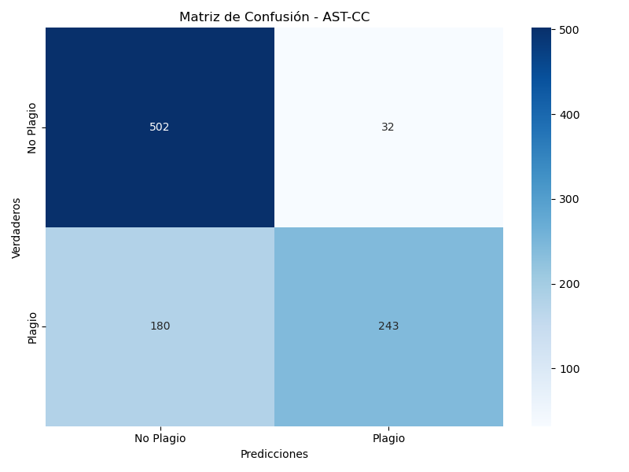
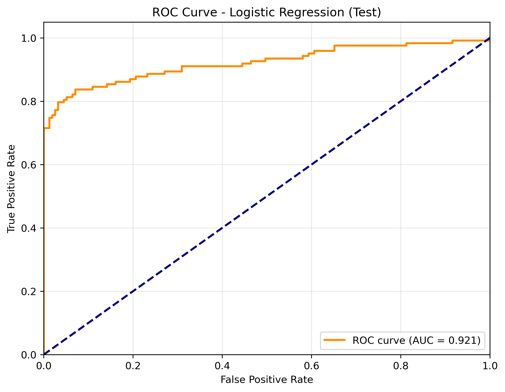

# 🔍 Sistema de Detección de Plagio en Código Java

Este proyecto implementa un sistema completo de detección de plagio en código fuente Java, combinando análisis estructural, representación vectorial y técnicas de aprendizaje automático. El objetivo es identificar similitudes entre archivos que puedan ser considerados como plagio, incluso si se han aplicado técnicas de ocultamiento como renombrar variables o reordenar código.

---

## 🚀 Tecnologías Implementadas

- **TF-IDF (Term Frequency - Inverse Document Frequency)**  
  Representación vectorial de texto para evaluar similitud semántica mediante n-gramas y distancia coseno.

- **AST-CC (Árboles de Sintaxis Abstracta - Componentes Característicos)**  
  Análisis estructural que compara la forma del código, ignorando nombres de variables y estilos de formato.

- **Clasificador de Regresión Logística**  
  Modelo entrenado con TF-IDF para predecir plagio con alta precisión.

---

## 📁 Estructura del Proyecto

```plaintext
├── astcc.py                # Detector estructural basado en AST
├── karia.py                # Detector TF-IDF + Regresión Logística
├── main.py                 # Comparación entre métodos (AST vs TF-IDF)
├── data/                   # Dataset estructurado en splits
│   └── splits/             # Archivos CSV + carpetas con código
├── csv/                    # Resultados numéricos exportados
├── images/                 # Visualizaciones de desempeño
├── models/                 # Modelos entrenados
├── requirements.txt        # Dependencias del proyecto
└── README.md               # Documentación del sistema
```

---

## ⚙️ Instalación

```bash
# 1. Clona el repositorio
git clone https://github.com/soydanteprz/tc3002b-ai.git

# 2.  Instala las dependencias
pip install -r requirements.txt
```

---

## 🧠 Métodos de Detección

### 🔤 TF-IDF + Cosine Similarity
Transforma el código en vectores de n-gramas para medir similitud textual. Detecta plagio incluso si el código ha sido reformulado.

### 🌳 AST-CC (Abstract Syntax Trees)
Analiza la estructura sintáctica del código. Este enfoque es bueno contra cambios simples como renombre de variables o formato distinto.

### 🤖 Regresión Logística
Modelo de clasificación que aprende patrones de plagio a partir de ejemplos reales. Usa como entrada vectores TF-IDF y genera predicciones con métricas precisas.

### ⚗️ Enfoque Híbrido
Combina predicciones de métodos estructurales y estadísticos. Ajusta pesos para optimizar el rendimiento del sistema.

---

## 📊 Evaluación del Desempeño

Se utilizan las siguientes métricas:

- **Accuracy**
- **Precision / Recall / F1-Score**
- **ROC-AUC**
- **Matrices de Confusión**

Los resultados se almacenan en:

- `csv/`: Archivos CSV con métricas detalladas
- `images/`: Visualizaciones como:
  - Matrices de confusión
  - Curvas ROC
  - Gráficas de importancia de características

---

## 🧪 Ejecución del Sistema

### Comparación entre métodos
```bash
python main.py
```

### Entrenamiento y evaluación del modelo ML
```bash
python karia.py
```

### Análisis estructural (AST)
```bash
python astcc.py
```

---

## 📷 Ejemplos de gráficas

| Matriz de Confusión (AST-CC) | Curva ROC (ML) | Características más importantes |
|------------------------------|----------------|----------------------------------|
|  |  |  |

---

## 🧠 Autores

Dante David Pérez Pérez

Iván Rodríguez Cuevas

Karla Alejandra Padilla González
